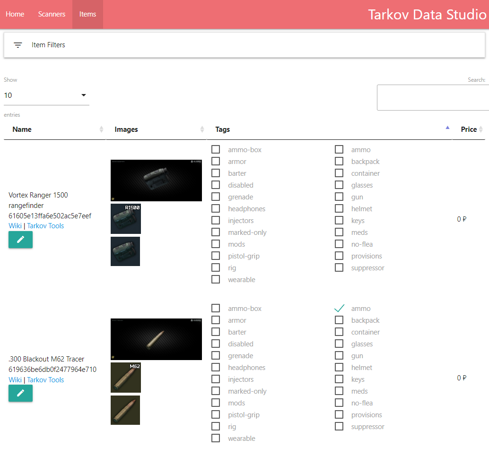

# Tarkov Data Manager 🛢️💻

The Tarkov Data Manager is a tool to manage the Tarkov game data collected by **scanners**.

It is a web application that allows you to do the following:

- Start, stop, and interact with scanners
- View the data collected by the scanners
- Make modifications to items or add missing images

## Example 📸



## Building Locally 🔨

This section is still under construction. We are working on creating a local environment to test the application locally with Docker and a mock instance of the database. Right now, developers connect to a testing branch of the prod database.

For active developers with database connections, you can run the following commands:

Install dependencies:

```bash
npm install
```

Run the application:

```bash
npm run dev
```
